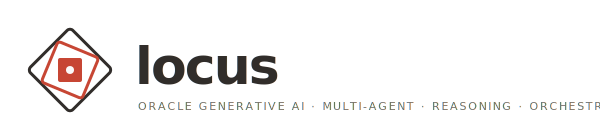
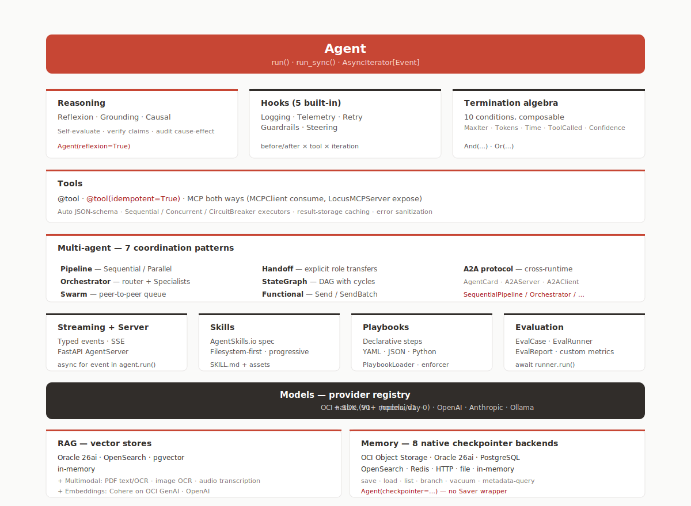

<p align="center">
  
</p>

<p align="center">
  <strong>Multi-agent workflows you'd actually deploy.</strong><br>
  Stream them. Branch them. Pause for a human. Resume next week.
</p>

<p align="center">
  
  
  
  
  
</p>

<p align="center">
  <a href="https://oracle-samples.github.io/locus/">Documentation</a> ·
  <a href="https://oracle-samples.github.io/locus/concepts/agent-loop/">Architecture</a> ·
  <a href="https://oracle-samples.github.io/locus/concepts/multi-agent/">Multi-agent</a> ·
  <a href="https://oracle-samples.github.io/locus/concepts/gsar/">GSAR</a> ·
  <a href="examples/">Tutorials</a> ·
  <a href="CONTRIBUTING.md">Contributing</a>
</p>

---

Seven workflow shapes you compose in one process or scale across a
mesh. **Compose** linear pipelines. **Orchestrate** specialists in
parallel. **Swarm** for peer-to-peer research. **Handoff** for
escalation desks. **StateGraph** loops until confident. **Functional**
maps across agents. **A2A** meshes across processes.

```bash
pip install "locus[oci]"
```

## Hello, multi-agent

Scatter a code-review crew across three files in parallel, reduce the
findings into one report — one `StateGraph.execute()` call. No
`asyncio.gather`, no shared mutable state.

```python
from locus import Agent
from locus.core.send import Send
from locus.multiagent.graph import END, START, StateGraph

REVIEWERS = ["security", "performance", "style"]

def reviewer(role: str) -> Agent:
    return Agent(model="oci:openai.gpt-5", system_prompt=f"You're a {role} reviewer.")

async def split(state):
    # Fan out: one Send per (file, role). The graph runs them in parallel.
    return [Send("review", {"file": f, "role": r}) for f in state["files"] for r in REVIEWERS]

async def review(state):
    out = reviewer(state["role"]).run_sync(state["file"])
    return {"finding": {"file": state["file"], "role": state["role"], "text": out.message}}

async def synthesize(state):
    findings = [v["finding"] for v in state.values() if isinstance(v, dict) and "finding" in v]
    return {"report": "\n".join(f"[{f['role']}] {f['file']}: {f['text']}" for f in findings)}

graph = StateGraph()
graph.add_node("split", split)
graph.add_node("review", review)
graph.add_node("synthesize", synthesize)
graph.add_edge(START, "split")
graph.add_edge("split", "synthesize")
graph.add_edge("synthesize", END)

result = await graph.execute({"files": ["auth.py", "billing.py", "search.py"]})
print(result.final_state["report"])
```

That's the whole shape: nodes do work, `Send` fans out, the executor
runs reviewers in parallel, `synthesize` reduces. No graph editor. No
YAML DAG. No `Saver` adapter. No `dict[str, Any]` state to babysit.

→ Full version: [examples/tutorial_42_map_reduce_code_review.py](examples/tutorial_42_map_reduce_code_review.py)

## What you get

The full surface in one table. Each row links to its concept page in
the [documentation](https://oracle-samples.github.io/locus/).

| | |
|---|---|
| **[🤝 Multi-agent workflows](https://oracle-samples.github.io/locus/concepts/multi-agent/)** | Seven shapes: Composition · Orchestrator + Specialists · Swarm · Handoff · StateGraph · Functional · A2A. One `Agent` class composes into all of them. Mix them in one process; stream events from any of them in the same `match` block. |
| **[🧰 Workflow primitives](https://oracle-samples.github.io/locus/concepts/multi-agent/graph/)** | `Send` for scatter-gather. `interrupt()` for human-in-the-loop. `Command(goto=...)` for explicit routing. `Agent(output_schema=...)` for typed terminal artifacts. `GraphConfig(allow_cycles=True)` for refinement loops. |
| **[🧠 Reasoning](https://oracle-samples.github.io/locus/concepts/reasoning/)** | `reflexion=True` (self-evaluate), `grounding=True` (LLM-as-judge claim verification), `CausalChain` for explicit cause-effect graphs. **[GSAR](https://oracle-samples.github.io/locus/concepts/gsar/)** typed-grounding layer for safety-critical pipelines — four-way claim partition + three-tier `{proceed, regenerate, replan}` decision ([`arXiv:2604.23366`](https://arxiv.org/abs/2604.23366)). |
| **[🛡 Idempotent tools](https://oracle-samples.github.io/locus/concepts/idempotency/)** | `@tool(idempotent=True)` — the ReAct loop dedupes repeat calls. The model can't double-charge, double-book, or double-page. |
| **[💾 Durable memory](https://oracle-samples.github.io/locus/concepts/checkpointers/)** | Four native checkpointers (OCI Object Storage, in-memory, file, HTTP) plus five storage backends (PostgreSQL, OpenSearch, Redis, SQLite, Oracle 26ai). One `BaseCheckpointer` Protocol — no adapter layer. |
| **[🔎 RAG on your data](https://oracle-samples.github.io/locus/concepts/rag/)** | Seven vector stores, OCI Cohere + OpenAI embeddings, multimodal (PDF text + OCR, image OCR, audio transcription). Oracle 26ai is the day-1 native target. |
| **[🧩 Skills + Playbooks](https://oracle-samples.github.io/locus/concepts/skills/)** | AgentSkills.io filesystem-first skills + declarative YAML/Python playbooks with a `PlaybookEnforcer` that validates tool calls against step constraints. |
| **[📡 Streaming + Server](https://oracle-samples.github.io/locus/concepts/server/)** | Typed events for `match`-statement consumers · SSE · drop-in FastAPI `AgentServer` with `thread_id` persistence (scoped to the bearer principal so two API keys can't read each other's threads). |
| **[🪝 Hooks](https://oracle-samples.github.io/locus/concepts/hooks/)** | `LoggingHook` / `StructuredLoggingHook` · `TelemetryHook` (OpenTelemetry) · `ModelRetryHook` · `GuardrailsHook` + `ContentFilterHook` · `SteeringHook` (LLM-as-judge tool approval). |
| **[🪙 MCP](https://oracle-samples.github.io/locus/concepts/mcp/)** | `MCPClient` consumes external Anthropic-spec MCP servers. `LocusMCPServer` exposes locus tools as MCP. Round-trip. |
| **[🌐 Multi-modal providers](https://oracle-samples.github.io/locus/concepts/multi-modal-providers/)** | `Agent(web_search=…, web_fetch=…, image_generator=…, speech_provider=…)` auto-registers a matching `@tool`. Built-in `HTTPXWebFetcher` + OpenAI search-preview / DALL-E / TTS+Whisper; bring your own via the four one-method Protocols. |
| **[📊 Evaluation](https://oracle-samples.github.io/locus/concepts/evaluation/)** | `EvalCase` / `EvalRunner` / `EvalReport` — regression suites, custom evaluators, pass / score / duration reporting. |
| **[🛂 Termination algebra](https://oracle-samples.github.io/locus/concepts/termination/)** | Eight composable stop conditions on `Agent(termination=…)`: `MaxIterations \| TextMention("DONE") & ConfidenceMet(0.9)` is real Python (`__or__` / `__and__` overloads). |
| **[🧰 Models](https://oracle-samples.github.io/locus/concepts/models/)** | OCI GenAI native (V1 + SDK transport, 90+ models, day-0) · OpenAI · Anthropic · Ollama. One auth surface for OCI: profile, session token, instance / resource principal. |
| **[🏗 OCI Dedicated AI Cluster](https://oracle-samples.github.io/locus/how-to/oci-dac/)** | Pass an `ocid1.generativeaiendpoint.<region>....` OCID and locus auto-routes to `DedicatedServingMode` with real SSE streaming. Live-tested against Qwen on a London DAC. |

## The agent loop

Every locus agent runs the same four-node loop —
**Think → Execute → Reflect → Terminate** — with one router deciding
transitions and one immutable state value flowing through.

<p align="center">
  
</p>

- **Think** streams the model's reasoning + the next action.
- **Execute** runs tool calls in parallel; tools tagged
  `@tool(idempotent=True)` are deduped against the run's history so
  retries return the cached receipt instead of re-firing the body.
- **Reflect** runs Reflexion / Grounding / Causal on cadence, on tool
  error, or when loop-detection trips — the router routes its
  judgement back into the next Think.
- **Terminate?** Typed stop conditions composable with `|` and `&`.
  Inspect, unit-test, audit; termination is just data.

Every node emits a typed, **write-protected** event. The same stream
powers SSE in `AgentServer`, the OpenTelemetry telemetry hook, the
structured logging hook, and your `async for event in agent.run(…)`
consumer.

[Read the full architecture →](https://oracle-samples.github.io/locus/concepts/agent-loop/)

## Architecture

<p align="center">
  
</p>

Ten layers, one runtime. The diagram is the source of truth for what
locus ships.

## Multi-agent — six in-process patterns plus A2A

Different problems want different shapes. All six in-process patterns
plus A2A share the same `Agent` class and the same event taxonomy.

| Pattern | When | Source |
|---|---|---|
| **Composition** (Sequential / Parallel / Loop) | linear chains; fan-out + merge; revise-until-confidence | [`agent/composition.py`](src/locus/agent/composition.py) |
| **Orchestrator + Specialists** | one router decides which expert handles each sub-task | [`multiagent/orchestrator.py`](src/locus/multiagent/orchestrator.py) |
| **Swarm** | open-ended research; peer-to-peer; shared context | [`multiagent/swarm.py`](src/locus/multiagent/swarm.py) |
| **Handoff** | escalation desks; conversation moves with full history | [`multiagent/handoff.py`](src/locus/multiagent/handoff.py) |
| **StateGraph** | explicit DAG with cycles, conditional edges, subgraphs | [`multiagent/graph.py`](src/locus/multiagent/graph.py) |
| **Functional** | map / reduce over agents; asyncio-native composition | [`multiagent/functional.py`](src/locus/multiagent/functional.py) |
| **A2A** | cross-process / cross-runtime; capability discovery | [`a2a/protocol.py`](src/locus/a2a/protocol.py) |

```python
from locus import Agent
from locus.agent import SequentialPipeline

researcher = Agent(model=model, system_prompt="Find three key facts.")
critic     = Agent(model=model, system_prompt="Find flaws in the previous output.")
finalizer  = Agent(model=model, system_prompt="Synthesize a one-paragraph answer.")

result = await SequentialPipeline(researcher, critic, finalizer).run("…")
```

[All multi-agent patterns →](https://oracle-samples.github.io/locus/concepts/multi-agent/)

## Quick start

```bash
pip install "locus[oci]"
export OCI_PROFILE=DEFAULT   # any profile in ~/.oci/config
```

A scheduling agent in 12 lines. The model uses the built-in date tool
to resolve "next Friday", then calls a write tool that's
`@tool(idempotent=True)` — so even if the LLM retries mid-iteration,
only one meeting ships:

```python
from locus import Agent, tool
from locus.tools.builtins import get_today_date

@tool(idempotent=True)
def book_meeting(date: str, attendees: list[str]) -> dict:
    """Book a meeting. Idempotent — re-fires return the cached event."""
    return calendar.book(date, attendees)

agent = Agent(
    model="oci:openai.gpt-5",
    tools=[get_today_date, book_meeting],
    system_prompt="You are a scheduling assistant.",
)

print(agent.run_sync(
    "Book a 30-min sync next Friday with alice@ and bob@."
).message)
# → "Booked a 30-min sync for next Friday, 2026-05-01, with alice@ and bob@.
#    Event ID: evt-001."
```

[Full quickstart →](https://oracle-samples.github.io/locus/how-to/quickstart/)

## Tutorials

[`examples/`](examples/) has 40 progressive tutorials, each a single
runnable file. The full set runs end-to-end in CI on every commit;
each tutorial is a working program against a real model.

| Track | Highlights |
|---|---|
| **Foundations** | [`01_basic_agent`](examples/tutorial_01_basic_agent.py) · [`05_agent_hooks`](examples/tutorial_05_agent_hooks.py) · [`07_state_management`](examples/tutorial_07_state_management.py) |
| **Tools & MCP** | [`12_mcp_integration`](examples/tutorial_12_mcp_integration.py) · [`38_multimodal_providers`](examples/tutorial_38_multimodal_providers.py) |
| **Reasoning** | [`14_reasoning_patterns`](examples/tutorial_14_reasoning_patterns.py) · [`39_gsar_typed_grounding`](examples/tutorial_39_gsar_typed_grounding.py) |
| **Multi-agent** | [`11_swarm_multiagent`](examples/tutorial_11_swarm_multiagent.py) · [`16_agent_handoff`](examples/tutorial_16_agent_handoff.py) · [`17_orchestrator_pattern`](examples/tutorial_17_orchestrator_pattern.py) · [`34_a2a_protocol`](examples/tutorial_34_a2a_protocol.py) |
| **RAG** | [`22_rag_basics`](examples/tutorial_22_rag_basics.py) · [`24_rag_agents`](examples/tutorial_24_rag_agents.py) |
| **Production** | [`19_guardrails_security`](examples/tutorial_19_guardrails_security.py) · [`20_checkpoint_backends`](examples/tutorial_20_checkpoint_backends.py) · [`28_agent_server`](examples/tutorial_28_agent_server.py) · [`37_termination`](examples/tutorial_37_termination.py) |
| **OCI** | [`29_model_providers`](examples/tutorial_29_model_providers.py) · [`40_oci_dac`](examples/tutorial_40_oci_dac.py) — Dedicated AI Cluster endpoints |

## Deploy

`AgentServer` is a drop-in FastAPI app. The repo ships a turn-key
deployment story:

- Multi-stage [`Dockerfile`](Dockerfile) — non-root user, `HEALTHCHECK`
  on `/health`, `pip install ".[oci,server,checkpoints]"`.
- Helm chart at [`deploy/helm/locus-agent/`](deploy/helm/locus-agent/) —
  Deployment, Service, ServiceAccount (with workload-identity hooks),
  Secret, HPA, Ingress, all driven by `values.yaml`.
- `pip install "locus[oci,server]"` for production installs.

```bash
docker build -t iad.ocir.io/$NAMESPACE/locus-agent:0.1.0 .
helm install locus-agent ./deploy/helm/locus-agent \
  --set image.repository=iad.ocir.io/$NAMESPACE/locus-agent \
  --set image.tag=0.1.0 \
  --set auth.apiKey=$(openssl rand -hex 16) \
  --set ociBucket.enabled=true \
  --set ociBucket.bucketName=locus-threads \
  --set ociBucket.namespace=$NAMESPACE
```

[Full deploy guide →](https://oracle-samples.github.io/locus/how-to/deploy/)

## Repo layout

```text
src/locus/
├── agent/          Agent runtime, config, composition pipelines
├── core/           AgentState, Message, events, termination algebra
├── loop/           ReAct nodes (Think, Execute, Reflect)
├── memory/         BaseCheckpointer + 9 backends
├── models/         Provider registry + OCI native, OpenAI, Anthropic, Ollama
├── multiagent/     Composition, Orchestrator+Specialist, Swarm, Handoff, Graph, Functional
├── a2a/            Cross-process Agent-to-Agent protocol
├── reasoning/      Reflexion, Grounding, Causal, GSAR (typed grounding)
├── rag/            Embeddings + 7 vector stores + retrievers
├── providers/      Multi-modal: web search, web fetch, image, speech
├── tools/          @tool decorator, registry, builtins, executors
├── hooks/          Logging, telemetry, retry, guardrails, steering
├── skills/         AgentSkills.io filesystem-first capability disclosure
├── playbooks/      Declarative step plans + PlaybookEnforcer
├── server/         FastAPI AgentServer with thread persistence
├── eval/           EvalCase + EvalRunner + EvalReport
└── integrations/   MCP (client + server)

tests/
├── unit/           Deterministic, no external deps. Runs in CI on every PR.
└── integration/    Live LLM / OCI / Oracle 26ai. Gated on credentials.
```

## Contributing

See [CONTRIBUTING.md](CONTRIBUTING.md). Quick start:

```bash
git clone https://github.com/oracle-samples/locus.git
cd locus
pip install -e ".[dev,all]"
hatch run check        # ruff format-check + ruff lint + mypy
hatch run test         # unit tests across the supported Python matrix
pre-commit install     # auto-run gitleaks, EOL, ruff, mypy on commit
```

Every PR runs through:

- **format-check + ruff + mypy** (Python 3.11 + 3.14)
- **unit tests** (Python 3.11 / 3.12 / 3.13 / 3.14 matrix)
- **pre-commit** (gitleaks, EOL, whitespace, doc8, markdownlint, YAML format, codespell, ruff, ruff-format)
- **DCO sign-off** (`git commit -s`)

## Citing GSAR

If you use the GSAR layer (typed grounding) in research or production
write-ups, please cite the paper:

```bibtex
@article{kamelhar2026gsar,
  title  = {GSAR: Typed Grounding for Hallucination Detection and Recovery in Multi-Agent LLMs},
  author = {Kamelhar, Federico A.},
  journal = {arXiv preprint arXiv:2604.23366},
  year   = {2026},
}
```

## License

[Universal Permissive License v1.0](LICENSE.txt). Built inside Oracle.
Used in production. Open to everyone.
