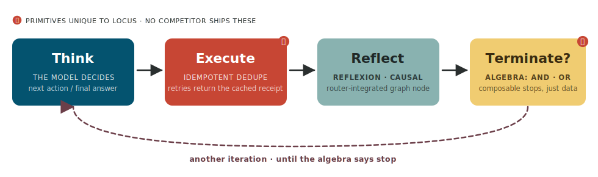

<p align="center">
  
</p>

<p align="center">
  <strong>Oracle Generative AI · Multi-Agent Reasoning Orchestrator SDK</strong><br>
  <em>Built inside Oracle. Used in production. Open to everyone.</em>
</p>

<p align="center">
  
  
  
  
  
</p>

<p align="center">
  <a href="https://oracle-samples.github.io/locus/">Documentation</a> ·
  <a href="https://oracle-samples.github.io/locus/concepts/router/">Cognitive Router</a> ·
  <a href="https://oracle-samples.github.io/locus/concepts/multi-agent/">Multi-agent</a> ·
  <a href="https://oracle-samples.github.io/locus/concepts/deepagent/">DeepAgent</a> ·
  <a href="examples/">56 Tutorials</a> ·
  <a href="workbench/">Workbench</a>
</p>

<p align="center">
  <a href="https://codespaces.new/oracle-samples/locus?devcontainer_path=.devcontainer%2Fdevcontainer.json">
    
  </a>
</p>

---

## Your first agent — 5 lines

```python
from locus import Agent

agent = Agent(model="oci:openai.gpt-5")
print(agent.run_sync("What is the capital of France?").text)
# → Paris
```

That's it. `Agent` handles the model call, the response, and any retries.
Swap `"oci:openai.gpt-5"` for `"openai:gpt-4o"` or `"anthropic:claude-sonnet-4-6"` — the interface stays the same.

## Add a tool

Tools are plain Python functions. The model sees the docstring and decides when to call them.

```python
from locus import Agent, tool

@tool
def get_weather(city: str) -> str:
    """Return the current weather for a city."""
    return weather_api.fetch(city)

agent = Agent(
    model="oci:openai.gpt-5",
    tools=[get_weather],
    system_prompt="You are a helpful travel assistant.",
)

print(agent.run_sync("Should I bring an umbrella to Tokyo tomorrow?").text)
```

The agent loops — Think → call tool → Think → answer — until it's done.
Add `@tool(idempotent=True)` to any tool that must not fire twice (bookings, payments, alerts).
The loop dedupes on `(name, args)` so retries are safe by design.

## Install

```bash
pip install "locus-sdk[oci]"           # OCI GenAI (90+ models, day-0)
pip install "locus-sdk[openai]"        # OpenAI
pip install "locus-sdk[anthropic]"     # Anthropic
pip install "locus-sdk[sdk]"           # everything
```

No mandatory cloud account to start — `MockModel` lets every tutorial run offline.

---

## The cognitive router — describe what you need, get the right shape

Once you know agents, the next step is knowing *which* shape to use.
The cognitive router takes a natural-language task, selects from eight proven coordination patterns,
and instantiates the right primitive — without you hand-coding the topology.

```python
from locus.deepagent.workflow import create_research_workflow, KEY_PROMPT

workflow = create_research_workflow(
    model=get_model(),
    tools=[web_search, web_fetch],
    grounding_threshold=0.65,
)

result = await workflow.execute({KEY_PROMPT: "What happened in mathematics in 2026?"})
print(result.final_state["summary"])
```

The workflow runs: **execute (ReAct)** → **causal inference** → **summarize** → **grounding eval** →
lightweight **regenerate** or full **replan** if grounding is too low.
Every step emits `research.*` SSE events you can stream in real time.

→ [Cognitive router concept](https://oracle-samples.github.io/locus/concepts/router/) ·
[Research workflow](https://oracle-samples.github.io/locus/concepts/deepagent/)

---

## Seven coordination patterns

When one agent isn't enough, locus gives you seven in-process shapes plus cross-process A2A.
Every pattern uses the same `Agent` class and the same event stream.

| Pattern | When to use |
|---|---|
| **SequentialPipeline** | A → B → C in order; each output feeds the next |
| **ParallelPipeline** | Fan out to N agents simultaneously, merge results |
| **LoopAgent** | Refine until a condition fires (PASS/FAIL, confidence, iteration cap) |
| **Orchestrator + Specialists** | One coordinator routes to domain experts in parallel |
| **Swarm** | Open-ended research; peers share a task queue and context |
| **Handoff** | Escalation desk; conversation moves with full history to the next specialist |
| **StateGraph** | Explicit DAG with conditional edges, cycles, and human-in-the-loop gates |
| **A2A** | Cross-process meshes over HTTP; agents advertise capabilities via AgentCard |

```python
from locus import Agent, SequentialPipeline

researcher = Agent(model=model, system_prompt="Find three key facts about the topic.")
critic     = Agent(model=model, system_prompt="Identify any gaps or errors in the research.")
writer     = Agent(model=model, system_prompt="Write a clear one-paragraph summary.")

result = await SequentialPipeline(agents=[researcher, critic, writer]).run(
    "Explain quantum entanglement to a high-schooler."
)
print(result.text)
```

→ [All patterns](https://oracle-samples.github.io/locus/concepts/multi-agent/)

---

## What you get

| | |
|---|---|
| **[🧭 Cognitive router](https://oracle-samples.github.io/locus/concepts/router/)** | Describe a task → eight named protocols → right primitive compiled automatically. LLM fills a typed schema; routing is deterministic. |
| **[🤝 Multi-agent](https://oracle-samples.github.io/locus/concepts/multi-agent/)** | Seven native patterns + cross-process A2A. One `Agent` class. One event stream. |
| **[🔬 DeepAgent](https://oracle-samples.github.io/locus/concepts/deepagent/)** | `create_deepagent` (single agent, per-turn grounding) and `create_research_workflow` (StateGraph with post-hoc grounding eval + two-level recovery). |
| **[📡 Observability](https://oracle-samples.github.io/locus/concepts/observability/)** | Opt-in `EventBus` — one `run_context()` streams 40+ canonical events from every layer, no external broker. `TelemetryHook` for OpenTelemetry/OTLP. |
| **[🧠 Reasoning](https://oracle-samples.github.io/locus/concepts/reasoning/)** | `reflexion=True` · `grounding=True` · `CausalChain` · **GSAR** typed grounding layer (`arXiv:2604.23366`). |
| **[🛡 Idempotent tools](https://oracle-samples.github.io/locus/concepts/idempotency/)** | `@tool(idempotent=True)` — dedupes on `(name, args)`. The model can't double-charge, double-book, or double-page. |
| **[💾 Durable memory](https://oracle-samples.github.io/locus/concepts/checkpointers/)** | 9 backends — OCI Object Storage, PostgreSQL, Redis, SQLite, Oracle 26ai, OpenSearch, in-memory, file, HTTP. |
| **[🔎 RAG](https://oracle-samples.github.io/locus/concepts/rag/)** | 7 vector stores · OCI Cohere + OpenAI embeddings · multimodal (PDF, image OCR, audio). |
| **[📡 Streaming + Server](https://oracle-samples.github.io/locus/concepts/server/)** | Typed events · SSE · `AgentServer` (FastAPI, per-principal thread isolation). |
| **[🪝 Hooks](https://oracle-samples.github.io/locus/concepts/hooks/)** | Logging · OpenTelemetry · ModelRetry · Guardrails · Steering (LLM-as-judge). |
| **[🪙 MCP](https://oracle-samples.github.io/locus/concepts/mcp/)** | `MCPClient` consumes MCP servers. `LocusMCPServer` exposes locus tools as MCP. |
| **[🌐 Multi-modal](https://oracle-samples.github.io/locus/concepts/multi-modal-providers/)** | `Agent(web_search=…, web_fetch=…, image_generator=…, speech_provider=…)` auto-registers tools. |
| **[📊 Evaluation](https://oracle-samples.github.io/locus/concepts/evaluation/)** | `EvalCase` / `EvalRunner` / `EvalReport` regression suites. |
| **[🧰 Models](https://oracle-samples.github.io/locus/concepts/models/)** | OCI GenAI (90+ models, V1 + SDK) · OpenAI · Anthropic · Ollama. |

---

## The agent loop

Every locus agent runs the same four-node loop —
**Think → Execute → Reflect → Terminate** — with one immutable state flowing through.

<p align="center">
  
</p>

- **Think** — model decides the next action or final answer.
- **Execute** — runs tool calls in parallel; `@tool(idempotent=True)` dedupes on `(name, args)`.
- **Reflect** — Reflexion, Grounding, Causal on cadence or on error.
- **Terminate?** — typed stop conditions: `MaxIterations(10) | ToolCalled("submit") & ConfidenceMet(0.9)`.

Every node emits a write-protected typed event — same stream powers SSE, telemetry hooks, and your own `async for event in agent.run(…)` consumer.

---

## 56 tutorials

[`examples/`](examples/) has 56 progressive tutorials, each a single runnable file.
Every tutorial runs offline with `MockModel`; set one env var to upgrade to a real provider.

```bash
git clone https://github.com/oracle-samples/locus.git
cd locus && pip install -e .

python examples/tutorial_01_basic_agent.py          # start here
python examples/tutorial_02_agent_with_tools.py     # add tools
python examples/tutorial_41_deepagent.py            # deep research
python examples/tutorial_51_cognitive_router.py     # routing
python examples/tutorial_56_research_workflow.py    # full research pipeline
```

| Track | What you learn |
|---|---|
| **Foundations** (01–05, 21, 27, 28, 37) | Agent, tools, memory, streaming, hooks, server, termination |
| **Graphs** (06–10, 25, 35, 36) | StateGraph, conditional routing, reducers, HITL, composition |
| **Multi-agent** (11, 16–18, 34, 41–45) | Swarm, handoff, orchestrator, A2A, DeepAgent, real-world crews |
| **Reasoning** (13, 14, 39) | Structured output, reflexion + grounding, GSAR typed grounding |
| **RAG** (22–24) | Basics, providers, RAG agents |
| **Skills, playbooks, plugins** (12, 15, 31–33) | MCP, playbooks, plugins, steering |
| **Production** (19, 20, 26, 29, 30, 38, 40) | Guardrails, checkpoints, evaluation, model providers, DAC |
| **Real-world workflows** (46–50) | Incident response, procurement, contract review, audio |
| **Cognitive router + observability** (51–56) | Routing, EventBus, agent yield bridge, event catalogue, research |

→ [Full tutorials index](https://oracle-samples.github.io/locus/tutorials/)

---

## Workbench

A browser-based playground for every locus pattern. Two clicks to a
running agent — no CLI install, no editor setup. Three model slots
(A / B / C) so multi-agent tutorials can mix a fast triage model
with a deeper specialist. Four sidebar tabs: **Tutorials** (every
runnable `tutorial_*.py`), **Skills** (SKILL.md packages),
**Protocols** (the eight cognitive-router shapes with cost / latency
metadata), and **Patterns** (the nine first-class
runtimes — including [Cognitive routing](docs/workbench.md#cognitive-routing-pattern)
with a Rule-based ⬌ LLM-picker toggle).

Pick the launch path that fits.

### Path A — GitHub Codespaces (zero install, free tier)

[](https://codespaces.new/oracle-samples/locus?devcontainer_path=.devcontainer%2Fdevcontainer.json)

Click the badge above (or [this link](https://codespaces.new/oracle-samples/locus?devcontainer_path=.devcontainer%2Fdevcontainer.json)).
GitHub provisions a Linux container in your account, runs
`.devcontainer/postCreate.sh` (Python 3.12 + Node 20 + `pip install
-e ".[dev,llm]"` + `npm install` for the workbench projects), then
backgrounds the three tiers (FastAPI runner :8100, Express BFF
:3101, Vite :5173). After ~2 minutes the workbench UI opens in a
second tab — VS Code Web on tab 1, the live app on tab 2. Click
**Provider settings** in the header, paste an OpenAI or Anthropic
key, pick a tutorial, hit **Run**.

You burn your own free Codespaces minutes (60 hrs/month on a personal
account). Oracle pays nothing. The OCI options in *Provider settings*
require a local `~/.oci/config` so they don't apply in
Codespaces — use OpenAI or Anthropic for the cloud demo path.

### Path B — Docker (local, BYO key)

```bash
git clone https://github.com/oracle-samples/locus.git && cd locus
docker build -t locus-workbench -f workbench/Dockerfile .
docker run --rm -p 5173:5173 -p 3101:3101 -p 8100:8100 locus-workbench
# open http://localhost:5173
```

Image is ~1.3 GB on first build (Oracle Linux 9-slim base + Python
3.12 + Node 20 + locus + the workbench source). Subsequent builds
hit the layer cache. If ports 5173 / 3101 / 8100 are in use locally,
remap them:

```bash
docker run --rm \
  -p 5273:5173 -p 3201:3101 -p 8200:8100 \
  locus-workbench
# then http://localhost:5273
```

Stop with `Ctrl-C`; the `--rm` flag removes the container on exit.

### Path C — From source (development)

For iterating on the workbench itself:

```bash
git clone https://github.com/oracle-samples/locus.git && cd locus
pip install -e ".[server,oci,openai,anthropic]"

# Three terminals, one per tier:
cd workbench/bff && npm install && npm run dev       # :3101
cd workbench/web && npm install && npm run dev       # :5173
cd workbench/backend && python -m uvicorn --app-dir . runner:app --port 8100
```

→ Full walkthrough: [Workbench guide](docs/workbench.md) · [Provider settings](docs/workbench.md#provider-settings) · [Cognitive routing pattern](docs/workbench.md#cognitive-routing-pattern) · [Troubleshooting](docs/workbench.md#troubleshooting)

---

## Deploy

```bash
pip install "locus-sdk[oci,server]"
```

`AgentServer` is a drop-in FastAPI app: `POST /invoke`, `POST /stream`, `GET/DELETE /threads/{id}`, `GET /health`.

```python
from locus.server import AgentServer

server = AgentServer(agent=my_agent, api_key=os.environ["API_KEY"])
server.run(host="0.0.0.0", port=8080)
```

The repo ships a multi-stage `Dockerfile` and a Helm chart at
[`deploy/helm/locus-agent/`](deploy/helm/locus-agent/) — Deployment, HPA, Ingress, OCI workload-identity hooks.

→ [Deploy guide](https://oracle-samples.github.io/locus/tutorials/deploy/)

---

## Repo layout

```text
src/locus/
├── agent/          Agent runtime, config, SequentialPipeline / ParallelPipeline / LoopAgent
├── core/           AgentState, Message, events, termination algebra, Send
├── loop/           ReAct nodes (Think, Execute, Reflect)
├── router/         Cognitive router — GoalFrame, ProtocolRegistry, PolicyGate, CognitiveCompiler
├── deepagent/      create_deepagent + create_research_workflow + 6 node primitives
├── observability/  EventBus, run_context, agent yield bridge, EV_* constants
├── memory/         BaseCheckpointer + 9 backends
├── models/         Provider registry + OCI, OpenAI, Anthropic, Ollama
├── multiagent/     Orchestrator, Swarm, Handoff, StateGraph, Functional
├── a2a/            Cross-process Agent-to-Agent protocol
├── reasoning/      Reflexion, Grounding, Causal, GSAR
├── rag/            Embeddings + 7 vector stores + retrievers
├── providers/      Multi-modal: web search, web fetch, image, speech
├── tools/          @tool decorator, registry, builtins, executors
├── hooks/          Logging, telemetry, retry, guardrails, steering
├── skills/         AgentSkills.io filesystem-first capability disclosure
├── playbooks/      Declarative step plans + PlaybookEnforcer
├── server/         FastAPI AgentServer with thread persistence
├── evaluation/     EvalCase + EvalRunner + EvalReport
└── integrations/   MCP (client + server)

workbench/          Browser playground — Tutorials / Skills / Protocols tabs,
                    three model slots, SSE event stream, Codespaces-ready.
examples/           56 progressive tutorials, each a single runnable file.
tests/unit/         Deterministic, no external deps. Runs in CI on every PR.
tests/integration/  Live OCI / OpenAI / Oracle Database 26ai. Gated on credentials.
```

---

## Contributing

```bash
git clone https://github.com/oracle-samples/locus.git
cd locus && pip install -e ".[dev,all]"
hatch run check        # ruff + mypy
hatch run test         # unit tests across Python 3.11–3.14
pre-commit install
```

See [CONTRIBUTING.md](CONTRIBUTING.md). Every PR runs format, lint, mypy, unit tests, DCO sign-off.

---

## Citing GSAR

```bibtex
@article{kamelhar2026gsar,
  title   = {GSAR: Typed Grounding for Hallucination Detection and Recovery in Multi-Agent LLMs},
  author  = {Kamelhar, Federico A.},
  journal = {arXiv preprint arXiv:2604.23366},
  year    = {2026},
}
```

---

## Security

Please consult the [security guide](./SECURITY.md) for our responsible security vulnerability disclosure process.

---

## License

Copyright (c) 2026 Oracle and/or its affiliates.

Released under the Universal Permissive License v1.0 as shown at
<https://oss.oracle.com/licenses/upl/>.
