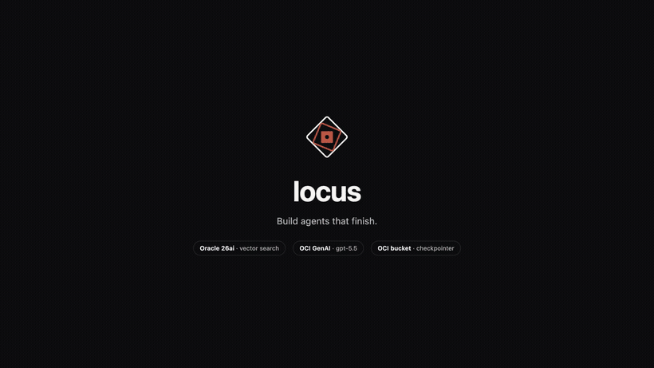
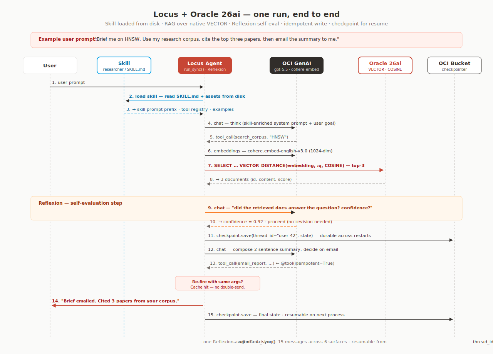

<p align="center">
  
</p>

<p align="center">
  
  
  
  
  
  
</p>

<p align="center">
  <strong>Build agents that finish.</strong>
</p>

<p align="center">
  Retrieve · reason · remember · recover.<br>
  Idempotent tools so they don't double-charge. Reflexion so they don't loop on a wrong premise.<br>
  Durable memory so they survive restarts. Eval so you can prove they shipped.
</p>

<p align="center">
  Built on OCI GenAI · Oracle 26ai · OCI Object Storage. Day-0 model support.<br>
  <strong>2,987</strong> unit tests + <strong>330+</strong> live integration tests on every commit.
</p>

<p align="center">
  <a href="#architecture">Architecture</a> ·
  <a href="#one-run-end-to-end">A run, end to end</a> ·
  <a href="#quick-start">Quick start</a> ·
  <a href="#capabilities">Capabilities</a> ·
  <a href="examples/">37 tutorials</a> ·
  <a href="CONTRIBUTING.md">Contributing</a>
</p>

<p align="center">
  
</p>

---

## Architecture

<p align="center">
  
</p>

Ten layers, one runtime. The diagram is the source of truth for what locus ships.

## One run, end to end

A real `agent.run_sync()` against Oracle 26ai. The agent loads a **skill**
from disk, **retrieves** from a native VECTOR index, **reasons** in a
Reflexion loop, calls an **idempotent** write tool, and **checkpoints** to
OCI Object Storage so the conversation resumes from `thread_id` on the next
process. Same agent, five services, no glue.

<p align="center">
  
</p>

The diagram is the design. The runnable program is at
[`examples/demos/oracle_26ai/`](examples/demos/oracle_26ai/) — `demo.py`
plus a one-shot `setup_corpus.py` that ingests five sample documents into
Oracle 26ai. Run against the live free-tier ADB it produces:


```text
 AGENT REPLY
 Sent a 2-sentence HNSW summary citing the top three corpus hits
 ("hnsw", "embeddings", "ivf") to me@org.com.

 TRACE
   1. skills(skill_name='researcher')
   2. search_corpus(topic='HNSW')        ← Oracle 26ai VECTOR similarity
   3. email_report(to='me@org.com')      ← @tool(idempotent=True)

 iterations: 4   tools: 3   email body sends: 1   checkpoint persisted: ✅
```

## What you get

| | |
|---|---|
| **🧠 Reasoning** | `reflexion=True` (self-evaluate) and `grounding=True` (LLM-as-judge claim verification) on `Agent(...)`. `CausalChain` is a separate graph builder for explicit cause-effect chains. |
| **🤝 Multi-agent** | Pipelines · Orchestrator + Specialists · Swarm · Handoff · StateGraph · Functional · A2A. Seven coordination patterns sharing one event type. |
| **🛡 Idempotent tools** | `@tool(idempotent=True)` — the ReAct loop dedupes repeat calls. The model can't double-charge, double-book, or double-page. |
| **💾 Durable memory** | Four native checkpointers (OCI Object Storage, in-memory, file, HTTP) plus five storage backends (PostgreSQL, OpenSearch, Redis, SQLite, Oracle 26ai) auto-wrapped via `StorageBackendAdapter` or the `*_checkpointer()` factories. |
| **🔎 RAG on your data** | Seven vector stores, OCI Cohere + OpenAI embeddings, multimodal (PDF text + OCR, image OCR, audio transcription). Oracle 26ai is the day-1 native target. |
| **🧩 Skills + Playbooks** | AgentSkills.io filesystem-first skills + declarative YAML/Python playbooks with a `PlaybookEnforcer`. |
| **📡 Streaming + Server** | Typed events for `match`-statement consumers · SSE · drop-in FastAPI `AgentServer` with `thread_id` persistence (scoped to the bearer principal so two API keys can't read each other's threads). |
| **🪝 Hooks** | `LoggingHook` / `StructuredLoggingHook` · `TelemetryHook` (OpenTelemetry) · `ModelRetryHook` · `GuardrailsHook` + `ContentFilterHook` · `SteeringHook` (LLM-as-judge tool approval). |
| **🪙 MCP both ways** | `MCPClient` consumes external Anthropic-spec MCP servers. `LocusMCPServer` exposes locus tools as MCP. Round-trip. |
| **📊 Evaluation** | `EvalCase` / `EvalRunner` / `EvalReport` — regression suites, custom evaluators, pass / score / duration reporting. |
| **🛂 Termination algebra** | Eight composable stop conditions on `Agent(termination=...)`: `MaxIterations \| TextMention("DONE") & ConfidenceMet(0.9)` is real Python (`__or__` / `__and__` overloads). |
| **🧰 Models** | OCI GenAI native (V1 + SDK transport, 90+ models, day-0) · OpenAI · Anthropic · Ollama. One auth surface for OCI: profile, session token, instance / resource principal. |

## Quick start

```bash
pip install "locus[oci]"
export OCI_PROFILE=DEFAULT   # any profile in ~/.oci/config
```

A scheduling agent in 12 lines. The model uses the built-in date tool to resolve
"next Friday", then calls a write tool that's `@tool(idempotent=True)` — so even if
the LLM retries mid-iteration, only one meeting ships:

```python
from locus import Agent, tool
from locus.tools.builtins import get_today_date

@tool(idempotent=True)
def book_meeting(date: str, attendees: list[str]) -> dict:
    """Book a meeting. Idempotent — re-fires return the cached event."""
    return calendar.book(date, attendees)        # your real calendar call

agent = Agent(
    model="oci:openai.gpt-5.5",                  # any OCI GenAI model ID
    tools=[get_today_date, book_meeting],
    system_prompt="You are a scheduling assistant.",
)

print(agent.run_sync(
    "Book a 30-min sync next Friday with alice@ and bob@."
).message)
# → "Booked a 30-min sync for next Friday, 2026-05-01, with alice@ and bob@.
#    Event ID: evt-001."
```

Three iterations, two tool calls. No Project OCID, no `Saver` adapter, no
`dict[str, Any]` state.


> The GIF runs [`examples/demos/agent_quickstart.py`](examples/demos/agent_quickstart.py)
> — a different three-tool program against `oci:openai.gpt-5.5` showing the trace.

---

## Capabilities

### Memory & checkpointing — 4 native + 5 storage-backed

The checkpointer is a first-class `Agent` argument. Four backends are
direct `BaseCheckpointer` subclasses — pass them straight to `Agent`.
The other five expose a simpler dict-shaped storage interface and ship
with `*_checkpointer()` factories that wrap them with
`StorageBackendAdapter`:

| Backend | When you use it | How to construct |
|---|---|---|
| **OCI Object Storage** *(native)* | Cloud-native; lifecycle policies handle retention | `OCIBucketBackend(bucket_name=..., namespace=...)` |
| **In-memory** *(native)* | Unit tests | `MemoryCheckpointer()` |
| **File** *(native)* | Local dev, deterministic tests | `FileCheckpointer(directory="./checkpoints")` |
| **HTTP** *(native)* | Delegate to a custom checkpoint service | `HTTPCheckpointer(base_url=...)` |
| **Oracle 26ai** *(storage)* | Your durable store *is* your DB; JSON columns, vacuum, full-text | `oracle_checkpointer(...)` |
| **PostgreSQL** *(storage)* | Already running PG (often alongside `pgvector` for RAG) | `postgresql_checkpointer(dsn=...)` |
| **OpenSearch** *(storage)* | Search-stack-native; metadata queries by index | `opensearch_checkpointer(...)` |
| **Redis** *(storage)* | Hot conversations, low latency, TTL semantics | `redis_checkpointer(url=...)` |
| **SQLite** *(storage)* | Single-process, embedded | `sqlite_checkpointer(path=...)` |

```python
from locus.memory.backends.oci_bucket import OCIBucketBackend

agent = Agent(
    model="oci:openai.gpt-5.5",
    checkpointer=OCIBucketBackend(bucket_name="my-app", namespace="ns"),
)

# Different process, different worker — same conversation:
await agent.run("Continue where we left off.", thread_id="user-42")
```

Source: [`src/locus/memory/`](src/locus/memory/) ·
concept doc: [`docs/concepts/checkpointers.md`](docs/concepts/checkpointers.md).

### Multi-agent — seven coordination patterns

Locus does not pick a single multi-agent metaphor. Different problems want
different shapes — locus ships seven, all sharing the same `Agent` and event types:

| Pattern | What it's for | Where it lives |
|---|---|---|
| **Pipeline** (Sequential / Parallel) | Linear chains; fan-out + merge | [`src/locus/agent/composition.py`](src/locus/agent/composition.py) |
| **Orchestrator + Specialist** | Router decides which expert handles each sub-task | [`src/locus/multiagent/orchestrator.py`](src/locus/multiagent/orchestrator.py) |
| **Swarm** | Peer-to-peer task queue with `SharedContext` | [`src/locus/multiagent/swarm.py`](src/locus/multiagent/swarm.py) |
| **Handoff** | Explicit role transfers carrying conversation history | [`src/locus/multiagent/handoff.py`](src/locus/multiagent/handoff.py) |
| **StateGraph** | DAG with cycles, conditional edges, subgraphs | [`src/locus/multiagent/graph.py`](src/locus/multiagent/graph.py) |
| **Functional** | `Send` / `SendBatch` for map/reduce | [`src/locus/multiagent/functional.py`](src/locus/multiagent/functional.py) |
| **A2A protocol** | Cross-runtime messaging via `AgentCard` | [`src/locus/a2a/`](src/locus/a2a/) |

```python
from locus import Agent
from locus.agent import SequentialPipeline

researcher = Agent(model=model, system_prompt="Find three key facts.")
critic     = Agent(model=model, system_prompt="Find flaws in the previous output.")
writer     = Agent(model=model, system_prompt="Compose a one-paragraph brief.")

result = await SequentialPipeline(agents=[researcher, critic, writer]).run(
    "Vector databases."
)
```

### RAG — 8 vector stores, multimodal corpus

```python
from locus.rag import RAGRetriever, OCIEmbeddings, OracleVectorStore

retriever = RAGRetriever(
    embedder=OCIEmbeddings(model_id="cohere.embed-english-v3.0"),
    store=OracleVectorStore(dsn="mydb_high", user="ADMIN", password=..., dimension=1024),
)
await retriever.add_file("manual.pdf")     # PDF text + image OCR + audio transcription
results = await retriever.retrieve("How do I rotate API keys?", limit=5)

agent = Agent(model=..., tools=[retriever.as_tool()])
```

| Surface | Implementations |
|---|---|
| **Vector stores** | Oracle 26ai (native `VECTOR`) · OpenSearch · Qdrant · Pinecone · pgvector · Chroma · in-memory |
| **Embeddings** | Cohere on OCI GenAI · OpenAI |
| **Multimodal** | PDF text extraction + OCR · image OCR + caption · audio transcription |
| **Retrieval** | Cosine / dot / Euclidean · top-k · metadata filtering · spotlight injection-safe |

Source: [`src/locus/rag/`](src/locus/rag/).

### Reasoning — agents that self-correct

```python
agent = Agent(
    model="oci:openai.gpt-5.5",
    tools=[search, summarize, validate_claim],
    reflexion=True,        # self-evaluate per turn
)
```

Three reasoning modules:

- **Reflexion** ([Shinn et al., 2023](https://arxiv.org/abs/2303.11366)) — the
  agent evaluates its own last step *before* stacking another tool call on top
  of a wrong premise. First-class on `Agent`: pass `reflexion=True` (or a
  `ReflexionConfig`). Configure confidence thresholds, diminishing-returns
  detection, per-iteration cadence.
- **Grounding** — LLM-as-judge claim verification: every factual statement
  the agent emits is checked against retrieved context. First-class on
  `Agent`: pass `grounding=True` (or a `GroundingConfig`).
- **Causal** — explicit cause-effect chains so you can audit *why* the agent
  did what it did. Available as a standalone graph builder (`CausalChain`);
  call its API from a tool or hook to attach nodes/edges as the agent
  observes facts. Not currently wired through an `Agent` kwarg.

Source: [`src/locus/reasoning/`](src/locus/reasoning/).

### Tools — idempotent, MCP both ways, executor-aware

```python
@tool(idempotent=True)
def transfer(from_acct: str, to_acct: str, amount: float) -> dict: ...
```

- **`@tool`** auto-derives a JSON schema from your typed Python function
  signature — the model sees a contract, not a docstring.
- **`@tool(idempotent=True)`** dedupes repeat calls with identical arguments inside
  a single run — eliminates the model-double-fires-a-write-tool class of bug.
- **MCP** works in both directions:
  - `MCPClient` consumes external MCP servers — hook any MCP-published tool into
    your agent.
  - `LocusMCPServer` exposes your locus tools as an MCP server so other agents can
    consume yours.
- **Executors** — `SequentialExecutor`, `ConcurrentExecutor`, `CircuitBreakerExecutor`
  for parallel / fault-tolerant tool execution.

### Hooks — observability, guardrails, steering

Built-in hook providers, plus your own. Hooks fire on
`before / after × invocation × tool × model` and `iteration_start / iteration_end`:

- **`LoggingHook`** / **`StructuredLoggingHook`** — agent + tool traces.
- **`TelemetryHook`** / **`NoOpTelemetryHook`** — counters, latencies,
  OpenTelemetry-compatible.
- **`ModelRetryHook`** — retry on transient model failures.
- **`GuardrailsHook`** + **`ContentFilterHook`** — PII / SQL / XSS /
  command-injection regex policies.
- **`SteeringHook`** — LLM-as-judge tool approval. The agent's about to call
  `send_email`? A second model gets to vote.

Source: [`src/locus/hooks/`](src/locus/hooks/).

### Streaming + server

```python
from locus.core.events import ThinkEvent, ToolStartEvent, TerminateEvent

async for event in agent.run("Plan a trip to Paris."):
    match event:
        case ThinkEvent(reasoning=r):         print(f"💭 {r}")
        case ToolStartEvent(tool_name=n):     print(f"🔧 {n}")
        case TerminateEvent(final_message=m): print(f"✅ {m}")
```

Typed events stream as the agent runs. For HTTP streaming over SSE,
locus ships a reference [`AgentServer`](src/locus/server/) (FastAPI) —
drop in your agent factory and you get `/invoke`, `/stream`, plus
`GET /threads/{id}` and `DELETE /threads/{id}` for thread management.
The client picks the `thread_id` in the request body; the server
prefixes it with the bearer principal hash before persisting, so two
API keys sharing one server can't read each other's threads.

### Skills + Playbooks

- **Skills** ([AgentSkills.io](https://agentskills.io) spec) — filesystem-first
  capability disclosure. Drop a `SKILL.md` plus supporting files in a directory,
  point your agent at it, the model picks up a new capability progressively.
- **Playbooks** — declarative step-by-step execution. Loader supports YAML,
  JSON, or Python. For workflows where you want a deterministic agent path with
  a `PlaybookEnforcer` validating each step.

Source: [`src/locus/skills/`](src/locus/skills/) ·
[`src/locus/playbooks/`](src/locus/playbooks/).

### Evaluation harness

```python
from locus.evaluation import EvalCase, EvalRunner

cases = [
    EvalCase(
        name="basic-arithmetic",
        prompt="What is 2+2?",
        expected_output_contains=["4"],
    ),
    # ...
]
runner = EvalRunner(agent=agent)
report = await runner.run(cases)
print(report.passed, report.total_cases, report.avg_score, report.total_duration_ms)
```

Run regression suites against your agent. Match on
`expected_output_contains` / `expected_output_not_contains` / `expected_tools`
or pass a custom evaluator. Source:
[`src/locus/evaluation/`](src/locus/evaluation/).

### Termination algebra

```python
from locus.core.termination import MaxIterations, ToolCalled, ConfidenceMet

stop = MaxIterations(10) | (ToolCalled("send_report") & ConfidenceMet(0.9))
agent = Agent(..., termination=stop)
```

Eight composable stop conditions — `MaxIterations`, `TokenLimit`,
`TimeLimit`, `TextMention`, `ToolCalled`, `ConfidenceMet`, `NoToolCalls`,
`CustomCondition` — plus `__or__` (`|`) and `__and__` (`&`) operator
overloads on every condition. Source:
[`src/locus/core/termination.py`](src/locus/core/termination.py).

### Models

| Provider | Transports | Notes |
|---|---|---|
| **OCI GenAI** | V1 (`/openai/v1`, real SSE) + SDK | 90+ models, day-0 support, no Project OCID required |
| **OpenAI** | `chat/completions` | Native, including reasoning families (gpt-4o, gpt-4.1, gpt-5*, o-series) |
| **Anthropic** | Messages API | Claude 4.x, prompt caching aware |
| **Ollama** | Local HTTP | For air-gapped / single-laptop dev |

OCI auth surface: config profile (laptops/CI), session token, instance principal
(OCI VMs / OKE), resource principal (OCI Functions). Same surface for V1 and SDK
transports.

---

## Installation extras

```bash
# Core (no model providers, no storage)
pip install locus

# Model providers
pip install "locus[openai]"
pip install "locus[anthropic]"
pip install "locus[ollama]"
pip install "locus[oci]"

# Storage backends
pip install "locus[sqlite]"
pip install "locus[redis]"
pip install "locus[postgresql]"
pip install "locus[opensearch]"

# Bundles
pip install "locus[models]"        # all LLM providers
pip install "locus[checkpoints]"   # all storage backends
pip install "locus[all]"           # everything
```

## More examples

[`examples/`](examples/) has 37 progressive tutorials, each a single runnable
file. Highlights:

- [`tutorial_01_basic_agent.py`](examples/tutorial_01_basic_agent.py) — start here
- [`tutorial_05_agent_hooks.py`](examples/tutorial_05_agent_hooks.py) — hook system
- [`tutorial_11_swarm_multiagent.py`](examples/tutorial_11_swarm_multiagent.py) — swarm
- [`tutorial_14_reasoning_patterns.py`](examples/tutorial_14_reasoning_patterns.py) — reflexion / grounding / causal
- [`tutorial_16_agent_handoff.py`](examples/tutorial_16_agent_handoff.py) — multi-agent handoff
- [`tutorial_17_orchestrator_pattern.py`](examples/tutorial_17_orchestrator_pattern.py) — orchestrator + specialists
- [`tutorial_22_rag_basics.py`](examples/tutorial_22_rag_basics.py) — RAG over a vector store
- [`tutorial_27_hooks_advanced.py`](examples/tutorial_27_hooks_advanced.py) — guardrails + steering
- [`tutorial_34_a2a_protocol.py`](examples/tutorial_34_a2a_protocol.py) — Agent-to-Agent protocol

## Repo layout

```
src/locus/
├── agent/          Agent runtime, config, composition pipelines
├── core/           AgentState, Message, events, termination algebra
├── loop/           ReAct nodes (Think, Execute, Reflect)
├── memory/         BaseCheckpointer + 9 backends
├── models/         Provider registry + OCI native, OpenAI, Anthropic, Ollama
├── tools/          @tool decorator, registry, builtins, executors, schema
├── hooks/          Hook events, registry, 5 built-ins
├── streaming/      AsyncIterator events, SSE, console handler
├── reasoning/      Reflexion, grounding, causal analysis
├── rag/            8 vector stores, embeddings, multimodal retrieval
├── multiagent/     Swarm, orchestrator, handoff, graph, functional pipelines
├── skills/         AgentSkills.io progressive disclosure
├── playbooks/      Declarative step-by-step execution
├── evaluation/     EvalCase, EvalRunner, EvalReport
├── integrations/   MCP (fastmcp) — both directions
├── server/         FastAPI HTTP wrapper (reference app)
└── a2a/            Agent-to-Agent protocol
```

## Testing

```bash
hatch run test          # 2987 unit tests, no services required (~6 s)
hatch run typecheck     # mypy strict
hatch run lint          # ruff + format check
hatch run all           # everything
```

Integration tests live in [`tests/integration/`](tests/integration/) and skip
cleanly when their service isn't available — see
[`tests/integration/conftest.py`](tests/integration/conftest.py) for the env-var
matrix and [`TESTING_LOCAL.md`](TESTING_LOCAL.md) for the full local setup
(Docker, Oracle 26ai wallet, OCI bucket, OpenSearch, Redis, PG, Qdrant).

## Trusted in production

Locus powers internal agentic workloads at Oracle. Every commit runs the full
test matrix against real OCI GenAI, Oracle 26ai, OCI Object Storage, OpenSearch,
Redis, and PostgreSQL — not mocks.

If you're already on OCI, locus is the SDK that was *built on* the same
primitives you're already paying for.

## Contributing

See [`CONTRIBUTING.md`](CONTRIBUTING.md) — it's the long version. Short version:

1. Sign the [Oracle Contributor Agreement](https://oca.opensource.oracle.com).
2. Branch from `main`. Use [Conventional Commits](https://conventionalcommits.org).
3. `hatch run all` must pass.
4. Open a merge request.

We treat new model providers, new checkpointer / RAG backends, hooks, evaluators,
docs, and tests as first-class contributions.

## Security

See [`SECURITY.md`](SECURITY.md) for vulnerability reporting.

Built-in: error-message sanitization (strips credentials, paths, OCIDs),
tool-argument validation against declared schemas, SQL identifier validation
in DB backends, write-protected hook events, and optional LLM-powered steering
for real-time tool approval.

## License

Copyright (c) 2025, 2026 Oracle and/or its affiliates. Released under the
[Universal Permissive License v1.0](LICENSE).

## Links

- [How-to: OCI GenAI models](docs/how-to/oci-models.md)
- [Oracle 26ai vector search](https://docs.oracle.com/en/database/oracle/oracle-database/23/vecse/)
- [OCI GenAI documentation](https://docs.oracle.com/en-us/iaas/Content/generative-ai/home.htm)
- [AgentSkills.io specification](https://agentskills.io)
- [Oracle Contributor Agreement](https://oca.opensource.oracle.com)
