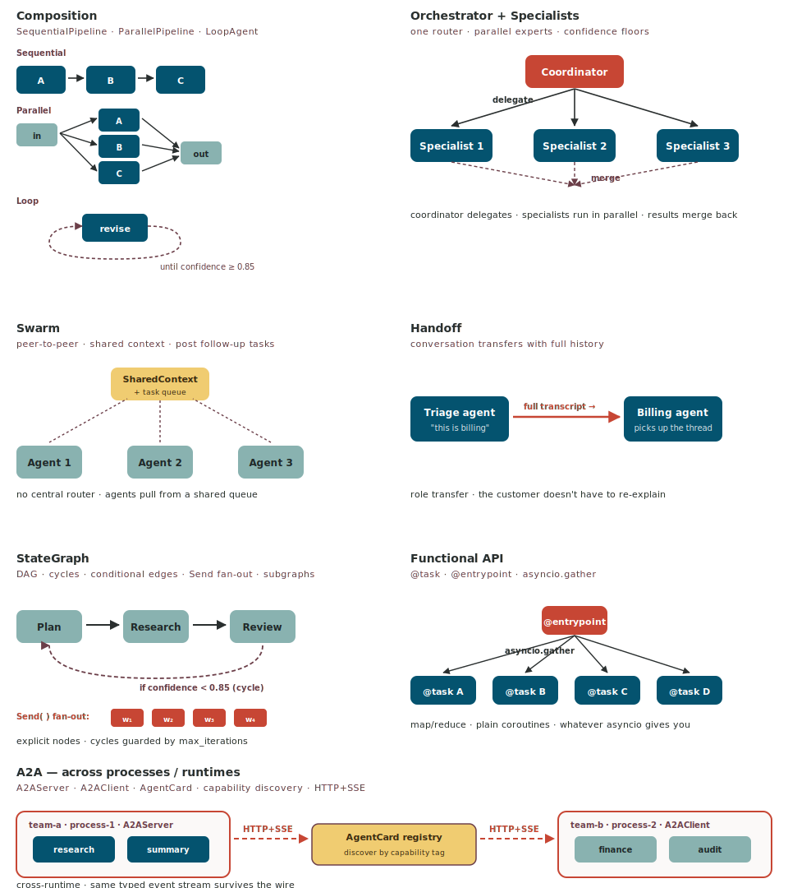

# Multi-agent orchestration

There is no single right way to coordinate agents. Different problems
want different shapes. locus ships **six in-process patterns plus
A2A across processes** — all sharing one `Agent` class and one event
type, so you can mix them in a single process and stream events from
any of them in the same `match` block.



## Pick a shape

```text
                ┌── do agents need to talk across processes / runtimes? ──┐
                │                                                         │
              yes ──→  A2A                                                no
                                                                          │
                  ┌─── need explicit control flow? ───┐
                  │                                   │
                yes                                   no
                  │                                   │
        ┌─────────┴───────────┐         ┌─────────────┴────────────┐
        │                     │         │                          │
   linear / fan-out       cycles?     central router?         no router
   no cycles               yes          yes                     │
        │                  │            │                       │
   Composition         StateGraph   Orchestrator + Specialists   Swarm
                                                                  │
                                                              one agent
                                                              hands off?
                                                                  │
                                                             yes  │  no
                                                                Handoff
```

When you write your own glue code (asyncio fan-out, retries,
schedulers): use the **Functional API** (`@task`, `@entrypoint`).
That's just a thinner wrapper that brings agent runs into the
ordinary asyncio universe.

## The seven patterns

| Pattern | Best for | Key class | Source |
|---|---|---|---|
| **[Composition](multi-agent/composition.md)** | linear chains; fan-out + merge; revise-until-confidence | `SequentialPipeline`, `ParallelPipeline`, `LoopAgent` | [`agent/composition.py`](https://github.com/oracle-samples/locus/blob/main/src/locus/agent/composition.py) |
| **[Orchestrator + Specialists](multi-agent/orchestrator.md)** | one router decides which expert handles each sub-task | `Orchestrator`, `Specialist` | [`multiagent/orchestrator.py`](https://github.com/oracle-samples/locus/blob/main/src/locus/multiagent/orchestrator.py) |
| **[Swarm](multi-agent/swarm.md)** | open-ended research; peer-to-peer; shared context | `Swarm`, `SharedContext` | [`multiagent/swarm.py`](https://github.com/oracle-samples/locus/blob/main/src/locus/multiagent/swarm.py) |
| **[Handoff](multi-agent/handoff.md)** | escalation desks; conversation moves with full history | `Handoff` | [`multiagent/handoff.py`](https://github.com/oracle-samples/locus/blob/main/src/locus/multiagent/handoff.py) |
| **[StateGraph](multi-agent/graph.md)** | explicit DAG with cycles, conditional edges, subgraphs | `StateGraph`, `Node`, `Edge` | [`multiagent/graph.py`](https://github.com/oracle-samples/locus/blob/main/src/locus/multiagent/graph.py) |
| **[Functional](multi-agent/functional.md)** | map/reduce over agents; asyncio-native composition | `@task`, `@entrypoint` | [`multiagent/functional.py`](https://github.com/oracle-samples/locus/blob/main/src/locus/multiagent/functional.py) |
| **[A2A](multi-agent/a2a.md)** | cross-process / cross-runtime; capability discovery | `A2AServer`, `A2AClient`, `AgentCard` | [`a2a/protocol.py`](https://github.com/oracle-samples/locus/blob/main/src/locus/a2a/protocol.py) |

## Quick examples

### Composition — sequential pipeline

```python
from locus.agent.composition import SequentialPipeline

pipeline = SequentialPipeline(agents=[researcher, summariser, fact_checker])
result = pipeline.run_sync("Brief on Q3 launch.")
```

A linear chain. Output of `researcher` feeds `summariser`, which
feeds `fact_checker`. Tutorial:
[tutorial_25_composition.py](https://github.com/oracle-samples/locus/blob/main/examples/tutorial_25_composition.py).

### Orchestrator + Specialists — one router, parallel experts

```python
from locus.multiagent import Orchestrator, Specialist

procurement = Specialist(name="procurement", agent=procurement_agent,
                         description="Reads the catalogue, quotes vendors.")
compliance  = Specialist(name="compliance",  agent=compliance_agent,
                         description="Vets vendors against SOC2 / ISO posture.")

orchestrator = Orchestrator(
    coordinator_model="oci:openai.gpt-5.5",
    specialists=[procurement, compliance],
    system_prompt="You are the procurement lead. Delegate to the right specialist.",
)

result = orchestrator.run_sync("Pick three vendors for $2M of cloud spend.")
```

Coordinator delegates each sub-task to the right specialist;
specialists run concurrently when the coordinator dispatches to
several of them at once. Tutorial:
[tutorial_17_orchestrator_pattern.py](https://github.com/oracle-samples/locus/blob/main/examples/tutorial_17_orchestrator_pattern.py).

### Swarm — peer-to-peer research

```python
from locus.multiagent import Swarm

swarm = Swarm(
    agents=[researcher, summariser, fact_checker],
    shared_context={"topic": "Q3 launch"},
    max_iterations=8,
)

result = swarm.run_sync("Produce a launch brief on Q3.")
```

No central router. Each agent reads `SharedContext` and pulls tasks
off a shared queue; new tasks any agent posts get picked up by the
next available peer. Tutorial:
[tutorial_11_swarm_multiagent.py](https://github.com/oracle-samples/locus/blob/main/examples/tutorial_11_swarm_multiagent.py).

### Handoff — escalation desk

```python
from locus.multiagent import Handoff

flow = Handoff(
    initial=triage_agent,
    targets={"billing": billing_agent, "shipping": shipping_agent},
)

result = flow.run_sync("My order #4321 was charged twice.")
```

The triage agent reads the conversation, decides which specialist
should take over, and emits a `Handoff(target="billing")` directive.
The full transcript transfers; the billing agent resumes the same
thread. Tutorial:
[tutorial_16_agent_handoff.py](https://github.com/oracle-samples/locus/blob/main/examples/tutorial_16_agent_handoff.py).

### StateGraph — explicit nodes, edges, cycles

```python
from locus.multiagent import StateGraph, END

graph = StateGraph(state_schema=ResearchState)
graph.add_node("plan", plan_agent)
graph.add_node("research", research_agent)
graph.add_node("review", review_agent)

graph.add_edge("plan", "research")
graph.add_edge("research", "review")
graph.add_conditional_edges(
    "review",
    lambda state: "research" if state.confidence < 0.85 else END,
)

result = graph.compile().run_sync({"prompt": "Write a launch brief."})
```

Pure-function router from `(node, state) → next node`. Cycles, fan-out,
subgraphs all work. Per-node `RetryPolicy` + `CachePolicy`. Mermaid
viz via `graph.compile().get_mermaid()`. Tutorials:
[06_basic_graph](https://github.com/oracle-samples/locus/blob/main/examples/tutorial_06_basic_graph.py) ·
[07_conditional_routing](https://github.com/oracle-samples/locus/blob/main/examples/tutorial_07_conditional_routing.py) ·
[35_graph_advanced](https://github.com/oracle-samples/locus/blob/main/examples/tutorial_35_graph_advanced.py).

### Functional API — map/reduce in asyncio

```python
import asyncio
from locus.multiagent.functional import task, entrypoint

@task
async def vet_vendor(vendor: dict) -> dict:
    return await compliance_agent.run(f"Vet {vendor['name']}.")

@entrypoint
async def vet_all(vendors: list[dict]) -> list[dict]:
    return await asyncio.gather(*[vet_vendor(v) for v in vendors])

scored = vet_all.run_sync(catalogue)
```

`@task` and `@entrypoint` adapt agent runs into the regular asyncio
universe. Use `asyncio.gather` for fan-out, `asyncio.timeout` for
deadlines, your own retry decorator — same primitives you use in any
async Python. Tutorial:
[tutorial_36_functional_api.py](https://github.com/oracle-samples/locus/blob/main/examples/tutorial_36_functional_api.py).

### A2A — across processes

```python
# host (team A's service)
from locus.a2a.protocol import A2AServer, AgentCard

card = AgentCard(
    name="vendor_research",
    description="Reads the vendor catalogue, quotes prices.",
    skills=["vendor_lookup", "price_quote"],
)
A2AServer(agent=research_agent, card=card).run(port=7421)
```

```python
# client (team B's service)
from locus.a2a.protocol import A2AClient

client = A2AClient.discover("http://research-host:7421")
reply = await client.send("Quote three options for $2M cloud.")
```

HTTP + SSE under the hood. `AgentCard` advertises the agent's
capabilities so consumers can pick the right peer by skill tag. Each
side keeps its own `Agent` runtime. Tutorial:
[tutorial_34_a2a_protocol.py](https://github.com/oracle-samples/locus/blob/main/examples/tutorial_34_a2a_protocol.py).

## One event stream across all of them

The whole point of having one `Agent` class is that all seven shapes
share the same event taxonomy:

```python
async for event in pipeline.run("Plan Q3"):
    match event:
        case ToolStartEvent(tool_name=n, agent_name=a):
            print(f"{a} → {n}")
        case TerminateEvent(final_message=m, agent_name=a):
            print(f"{a} done: {m}")
```

`agent_name` is set on every event so you can attribute output to the
specialist that produced it. SSE streams from the `AgentServer` carry
the same shape — your front-end consumer is unchanged whether the
back-end is a single agent, an orchestrator, a swarm, or an A2A mesh.

## Mixing shapes

Nothing stops you running a `Swarm` whose members are themselves
`Orchestrator`s, with a `StateGraph` wrapping the whole thing for
retry policy. The patterns compose; pick the shape that fits each
layer of the problem.

## See also

- [Agent Loop](agent-loop.md) — the loop every agent in every shape runs.
- [Hooks](hooks.md) — observe and steer across all of them.
- [Streaming](streaming.md) — the typed event taxonomy.
