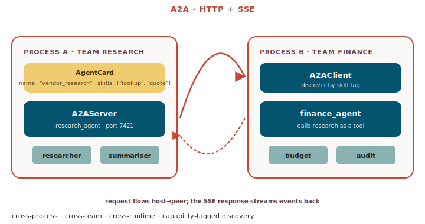

# A2A — Agent-to-Agent

A2A is the **cross-process / cross-runtime** version of multi-agent.
Each agent runs as its own service, advertises an `AgentCard`
(capabilities + contact info), and other agents discover and call it
over HTTP.

{ .diagram }

## What it is

The protocol is **HTTP + Server-Sent Events**. Each side keeps its
own `Agent` runtime; the wire format is a typed JSON envelope:

| Component | Where it lives |
|---|---|
| **`A2AServer`** | hosts an agent — `serve` exposes `/invoke`, `/stream`, `/card` |
| **`A2AClient`** | calls a peer — `discover()` reads the `AgentCard`; `send()` invokes |
| **`AgentCard`** | name + description + skills (capability tags) + endpoint |

Discovery uses the `AgentCard` so a router can pick agents by
capability tag. Auth and TLS are standard HTTP concerns — the same
load balancer / IAM you already use applies.

## When to use it

- ✅ **Multi-process or multi-host** agent deployments.
- ✅ Different **teams own different agents** on different stacks
  (different repos, different deploy cadences, different on-call).
- ✅ You need a **network boundary** for security or scaling reasons
  (the research agent has access to a corpus the finance agent
  shouldn't).
- ✅ **Polyglot** — a locus agent calling a non-locus A2A peer (or
  vice versa) speaks the same protocol.
- ✅ **Capability-based discovery** matters — the caller doesn't
  know which host has the right agent.

## When NOT to use it

- ❌ **Single-process** — use one of the in-process patterns; HTTP
  round-trips are pure overhead.
- ❌ **Tight latency requirements** — A2A adds 10–50ms per hop.
- ❌ The peer is **always the same agent** — just call it directly.

## Code

### Host side — expose an agent over A2A

```python
from locus import Agent
from locus.a2a.protocol import A2AServer, AgentCard

research_agent = Agent(
    model="oci:openai.gpt-5.5",
    tools=[search_corpus, summarise, cite],
    system_prompt="You read the vendor catalogue and quote prices.",
    checkpointer=OCIBucketBackend(bucket_name="research-threads"),
)

card = AgentCard(
    name="vendor_research",
    description="Reads the vendor catalogue. Quotes prices.",
    skills=["vendor_lookup", "price_quote", "soc2_check"],
)

server = A2AServer(agent=research_agent, card=card)
server.run(port=7421)
```

### Client side — discover and call

```python
from locus.a2a.protocol import A2AClient

# Discover by URL (the AgentCard is fetched, capability tags inspected)
client = A2AClient.discover("http://research-host:7421")

# Call as if it were a local agent
reply = await client.send(
    "Quote three options for $2M cloud spend.",
    thread_id="finance-q3-2026",
)
print(reply.message)
```

### Capability-tagged discovery

```python
# Find any peer that advertises the "soc2_check" skill
client = A2AClient.discover_by_skill(
    "soc2_check",
    registry="https://internal-agent-registry.example.com",
)
```

A `registry` is just an HTTP service that serves a list of
`AgentCard`s. You can use the simple reference one in
`a2a/registry.py` or roll your own.

## Streaming over the wire

A2A streams the same typed events as a local agent — `ThinkEvent`,
`ToolStartEvent`, `ReflectEvent`, `TerminateEvent`. SSE on the
underlying HTTP, JSON-encoded events, one per `data:` line.

```python
async for event in client.stream("Quote three options..."):
    match event:
        case ThinkEvent(reasoning=r) if r:    print(f"💭 {r}")
        case ToolStartEvent(tool_name=n):     print(f"🔧 {n}")
        case TerminateEvent(final_message=m): print(f"✅ {m}")
```

The client-side consumer loop is identical to a local one. The
network is invisible.

## Auth + TLS

A2A doesn't define its own auth scheme. Wrap the `A2AServer` in any
HTTP auth middleware your stack already uses:

- **API key** in the `X-API-Key` header.
- **mTLS** at the load balancer.
- **OAuth2** with the standard FastAPI flow.

`A2AServer` is built on FastAPI under the hood, so anything
FastAPI-shaped works.

## Tutorial

[`tutorial_34_a2a_protocol.py`](https://github.com/oracle-samples/locus/blob/main/examples/tutorial_34_a2a_protocol.py)
— host + client + capability discovery + streaming.

## Source

[`a2a/protocol.py`](https://github.com/oracle-samples/locus/blob/main/src/locus/a2a/protocol.py)
— `A2AServer:84` · `A2AClient:295` · `AgentCard:75` · `A2AMessage`,
`A2ARequest`, `A2AResponse`.

## See also

- [Multi-agent overview](../multi-agent.md) — pick a shape.
- [Agent Server](../server.md) — the in-process FastAPI wrapper that
  A2A is built on top of.
- [Conversation Management](../conversation-management.md) —
  `thread_id` flows across A2A so peers share context.
