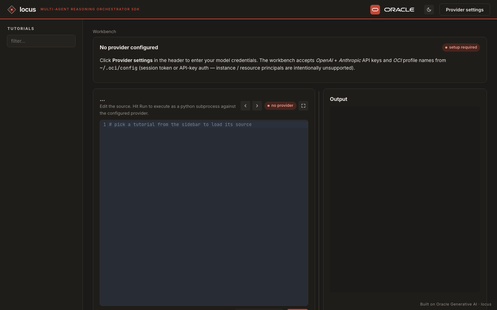

# Locus workbench — spin it up in 60 seconds

The workbench is a three-tier playground for exercising every locus
pattern (basic agent, tools, structured output, orchestrator,
map-reduce, critic loop, …) against your own model provider.



It's a vanilla TypeScript front-end (Vite) talking to a Node Express
BFF, talking to a FastAPI Python runner that imports `locus`. You
paste your provider key once per tab — **the workbench never
persists API keys to localStorage** — pick a tutorial in the sidebar,
hit Run, and watch the agent stream events back.

## Pick your path

| You want… | Run |
|---|---|
| Click and try, no install | [Open in GitHub Codespaces](https://codespaces.new/oracle-samples/locus?devcontainer_path=.devcontainer%2Fdevcontainer.json) |
| Run on your machine | `docker run …` (below) |
| Hack on the workbench source | `make backend / bff / web` (below) |

## Path 1 — GitHub Codespaces (zero install)

1. Click [Open in Codespaces](https://codespaces.new/oracle-samples/locus?devcontainer_path=.devcontainer%2Fdevcontainer.json).
2. Wait ~2 minutes for `.devcontainer/postCreate.sh` to install
   Python deps + npm deps + boot the three tiers.
3. The "Ports" panel pops up; click the URL next to **5173 (Workbench
   UI)**. New tab opens.
4. Click **Provider settings** → paste an OpenAI or Anthropic key →
   Save.
5. Pick a tutorial in the sidebar → **Run**.

You burn your own free Codespaces minutes (60 hrs/month), nothing on
the locus side. OpenAI / Anthropic costs ride on your own key.

The OCI options in the provider modal don't work in Codespaces —
they expect a local `~/.oci/config` that doesn't exist in the
container. Use OpenAI or Anthropic for the cloud demo path.

## Path 2 — Docker (local, BYO key)

The Dockerfile ships everything needed — Python 3.12 + Node 20 + the
locus wheel + the workbench source — in one image based on Oracle
Linux 9 slim.

```bash
git clone https://github.com/oracle-samples/locus.git
cd locus

# Build the image (~5 min cold, then layer cache).
docker build -t locus-workbench -f sandbox/Dockerfile .

# Run; published ports map to the canonical workbench layout.
docker run --rm \
  -p 5173:5173 \
  -p 3101:3101 \
  -p 8100:8100 \
  locus-workbench

# Then open http://localhost:5173
```

Container size is ~1.3 GB. Stop with `Ctrl-C`; `--rm` removes the
container automatically.

If the canonical ports are taken on your host, remap:

```bash
docker run --rm \
  -p 5273:5173 -p 3201:3101 -p 8200:8100 \
  locus-workbench
# then http://localhost:5273
```

## Path 3 — From source (development)

For iterating on the workbench itself:

```bash
git clone https://github.com/oracle-samples/locus.git
cd locus
pip install -e ".[server,oci,openai,anthropic]"  # core + extras

# Three terminals, one per tier:
cd sandbox/bff && npm install && npm run dev      # :3101
cd sandbox/web && npm install && npm run dev      # :5173
cd sandbox/backend && python -m uvicorn --app-dir . runner:app --port 8100
```

Or use the `Makefile` in `sandbox/`:

```bash
cd sandbox && make install
make backend   # in pane 1
make bff       # in pane 2
make web       # in pane 3
```

## Provider settings

The header's **Provider settings** modal accepts four shapes:

- **OpenAI** — paste `sk-…` + pick a model (defaults to `gpt-5.5`).
- **Anthropic** — paste `sk-ant-…` + pick a model
  (defaults to `claude-sonnet-4-6`).
- **OCI session token** — `profile` (e.g. `BOAT-OC1`) +
  `compartment_id` + `region`. Reads `~/.oci/config` at runtime;
  needs a valid session token. Local-machine only.
- **OCI api-key** — same shape, different OCI auth type. Local-machine
  only.

Settings live in the page's memory. Closing the tab discards them.
Reopening the page = paste again. This is intentional: an API key
sitting in `localStorage` on a shared computer is a leak waiting to
happen.

## What you can run

The catalog populates from the BFF's `/api/tutorials` endpoint, which
walks `examples/tutorial_*.py`. As of writing the workbench has 7
patterns wired through dedicated FastAPI endpoints (basic agent,
agent + tools, structured output, orchestrator + specialists,
sequential composition, map-reduce, critic loop) and the rest run as
plain Python subprocesses against your provider — same behaviour as
running the tutorial from a terminal, just inside the workbench so
you can watch streamed events instead of tailing stdout.

## Cost

**You pay $0** when someone uses the workbench. Each visitor's
compute hits their own free GitHub / their own Docker, and their
model calls hit their own provider key. Oracle pays $0 unless an
oracle-employee opens it AND `oracle-samples` org Codespaces billing
is enabled.

## Troubleshooting

- **Sidebar is empty** — BFF couldn't reach the backend. Check
  `docker logs <container>` or the runner pane: usually means the
  backend hasn't finished starting yet (10-20s on cold boot).
- **"Provider settings: setup required" never goes away** — you
  closed the modal without hitting Save. Reopen and click Save.
- **OCI session-token auth says "no profile"** — you're running in
  Codespaces / Docker; OCI auth needs `~/.oci/config` mounted in.
  Switch to OpenAI or Anthropic.
- **Tutorial fails with "no parsed Pydantic" / empty output** — your
  model is too small for structured output. Use `gpt-5.5-2026-04-23`,
  `gpt-4o`, or `claude-sonnet-4-6` for the demos that use
  `output_schema`.
